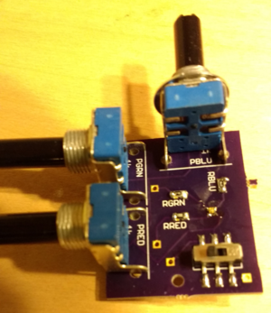
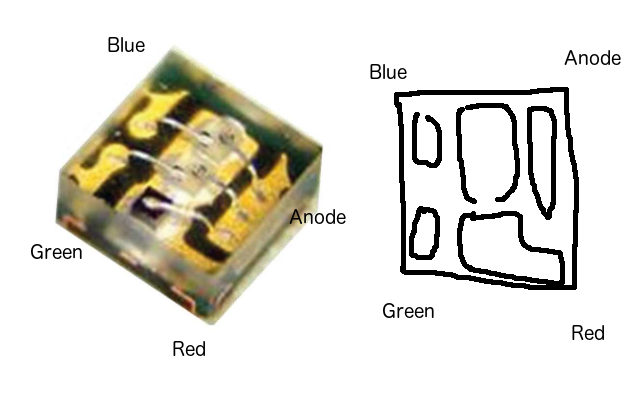

This circuit board has three knobs (pots) and one red, green, blue LED.  Turning the knobs adjusts the amount of red/green/blue emitted.

# How to orient the LED

The anode of the LED attaches to the top-right pad.  There ought to be two white lines around the anode pad.  When looking at the LED, look for a little L shape inside--that's the red corner which goes to the bottom right.

# How to solder the tiny LED

It's pretty tricky to solder the LED, but it can be done.  Put a little solder on *one* pad.  Next hold the LED in place on the solder then place the iron on the pad to melt the solder and let the LED sink into place.  Pull the iron away and then let go of the LED.  The other 3 pads should be easier :)

# Which resistor goes where?

The two same-valued resistors go in the green and blue spots.  The other resistor goes with red.

# Improvements

Things I'd like to do if I redesign it:

- Tune the pots so that there's less dead space when turning.
