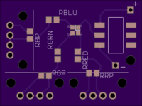

This circuit board has three knobs (pots) and one red, green, blue LED.  Turning the knobs adjusts the amount of red/green/blue emitted.

# How to orient the LED

The anode of the LED attaches to the top-right pad.  There ought to be two white lines around the anode pad.  When looking at the LED, look for a little L shape inside--that's the red corner which goes to the bottom right.

The white arrow here is pointing to the anode pad:

# How to solder the tiny LED

It's pretty tricky to solder the LED, but it can be done.  Put a little solder on *one* pad.  Next hold the LED in place on the solder then place the iron on the pad to melt the solder and let the LED sink into place.  Pull the iron away and then let go of the LED.  The other 3 pads should be easier :)

# Which resistor goes where?

There are 3 required resistors.  Here are their values:

| Name | Value |
|---|---|
| RRED | 100 Ohm |
| RGRN | 60 Ohm |
| RBLU | 60 Ohm |

There are 3 optional resistors that, if present, will remove a lot of the "dead space" when turning the knobs.

| Name | Value |
|---|---|
| RRP | ~453 Ohm |
| RGP | ~422 Ohm |
| RBP | 300 Ohm |

# Battery

This takes a single CR2032 battery.

# Improvements

Things I'd like to do if I redesign it:

- Find physically smaller pots.  They're disproportionally huge.
- Use a button instead of a switch (so they don't die).
